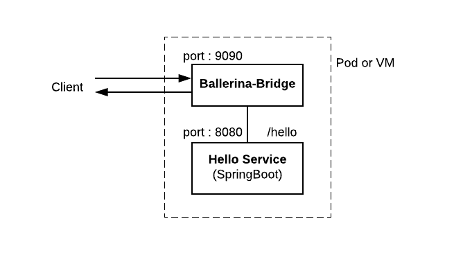

# Running Spring Boot HelloWorld service with Ballerina Sidecar 

## Use Case 

This sample demonstrate a how a simple Spring Boot service can be deployed with Ballerina Bridge. 




### Building the Spring Boot HelloWorld service 

- You find the docker image of the HelloWorld Spring Boot service in `` ballerina/bridge-sample-spring-helloworld``. 

``` 
    docker pull ballerina/bridge-sample-spring-helloworld
```
- Or you can build locally with maven. The Spring Boot Hello service is located at `` ballerina-bridge/samples/getting-started/springboot-helloworld/service`` directory.  

- You can locally build the executable and the docker image for the Spring Boot HelloWorld service using the following mvn command.  

    `` $ mvn clean install -Ddocker.image.prefix=<your-docker-image-prefix> dockerfile:build ``

## Running on Kubernetes  

- You can integrate Ballerina Bridge with your non-Ballerina service by pulling the Ballerina Bridge image and deploying it alongside your non-Ballerina service in the same Kubernetes pod. 
- The Ballerina Bridge ships with the Kubernetes deployment artifacts that you can use to deploy sidecar with your non-ballerina services. They are located in `` src/kubernetes``. 
- Copy ``src/kubernetes`` artifacts to `` samples/getting-started `` and inject your Spring Boot service deployment information to the deployment descriptor. 
- For this sample scenario, you can do this by changing the `` kubernetes/ballerina_bridge_sidecar_deployment.yaml `` as shown below:  

```yaml
    spec:
      containers:
      - name: bridge-sample-spring-helloworld
        image: ballerina/bridge-sample-spring-helloworld
        imagePullPolicy: Always
        ports:
        - containerPort: 8080
      - args: []
        command: []
        env:
        - name: "PRIMARY_SERVICE_PORT"
          value: "8080"
        - name: "CONFIG_FILE"
          value: "/home/ballerina/conf/ballerina.conf"
        - name: "SIDECAR_PORT"
          value: "9090"
        - name: "PRIMARY_SERVICE_HOST"
          value: "127.0.0.1"
        - name: "SIDECAR_HOST"
          value: "127.0.0.1"
        envFrom: []
        image: "ballerina/bridge:0.970"
        imagePullPolicy: "IfNotPresent"
        name: "ballerina-bridge"
        ports:
        - containerPort: 9090
          protocol: "TCP"
        volumeMounts:
        - mountPath: "/home/ballerina/conf/"
          name: "bridgesidecar-ballerina-conf-config-map-volume"
          readOnly: false
      hostAliases: []
         
         ... 
```
- Now you can deploy the Kubernetes artifacts with `` kubectl create -f ./samples/getting-started/kubernetes``. If the deployment is successful, you should see:

```

```

- Verify Kubernetes deployment, service and ingress is running. 

- Access the service via the bridge sidecar using the ingress. 

To access the service via Ingress interface, you should modify the following entry. 
Add /etc/host entry to match hostname. 
```
127.0.0.1 ballerina.bridge.io

``` 
Access the service: 

```
$ curl http://ballerina.bridge.io/hello
 Hello World, from Spring Boot and Ballerina Sidecar!
```

