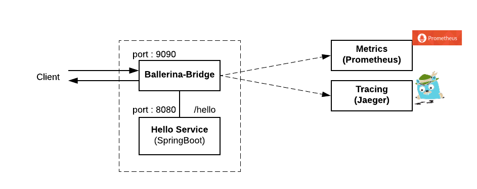

# Observability with Ballerina Bridge 

## Use Case 

This sample demonstrate a how a simple Spring Boot service can be made observable with the use of Ballerina Bridge, 
so that you don't want to add any code level changes to your service.   




### Building the Spring Boot HelloWorld service 

- You can use the same service from 'getting-started' sample and follow the same steps to deploy. 
## Running on Kubernetes  

- You can integrate Ballerina Bridge with your non-Ballerina service by pulling the Ballerina Bridge image and deploying it alongside your non-Ballerina service in the same Kubernetes pod. 
- The Ballerina Bridge ships with the Kubernetes deployment artifacts that you can use to deploy sidecar with your non-ballerina services. They are located in `` src/kubernetes``. 
- Copy ``src/kubernetes`` artifacts to `` samples/getting-started `` and inject your Spring Boot service deployment information to the deployment descriptor. 
- For this sample scenario, you can do this by changing the `` kubernetes/ballerina_bridge_sidecar_deployment.yaml `` as shown below:  

```yaml
    spec:
      containers:
      - name: bridge-sample-spring-helloworld
        image: ballerina/bridge-sample-spring-helloworld
        imagePullPolicy: Always
        ports:
        - containerPort: 8080
      - args: []
        command: []
        env:
        - name: "PRIMARY_SERVICE_PORT"
          value: "8080"
        - name: "CONFIG_FILE"
          value: "/home/ballerina/conf/ballerina.conf"
        - name: "SIDECAR_PORT"
          value: "9090"
        - name: "PRIMARY_SERVICE_HOST"
          value: "127.0.0.1"
        - name: "SIDECAR_HOST"
          value: "127.0.0.1"
        envFrom: []
        image: "ballerina/bridge:0.970"
        imagePullPolicy: "IfNotPresent"
        name: "ballerina-bridge"
        ports:
        - containerPort: 9090
          protocol: "TCP"
        volumeMounts:
        - mountPath: "/home/ballerina/conf/"
          name: "bridgesidecar-ballerina-conf-config-map-volume"
          readOnly: false
      hostAliases: []
         
         ... 
```

- **Observability** : To enable observability for your Spring Boot service via Ballerina Bridge, you need to modify the `` ballerina_bridge_sidecar_config_map.yaml``
with the required connection parameter to the observability tool that you are using. 
So, for instance if you use Jaeger for tracing, you need to update config by enabling Jaeger tracing to true, specify Jaeger host and port to publish the tracing data. 

- Now you can deploy the Kubernetes artifacts with `` kubectl create -f ./samples/getting-started/kubernetes``. 

- Verify Kubernetes deployment, service and ingress is running. 

- Access the service via the bridge sidecar using the ingress. 

To access the service via Ingress interface, you should modify the following entry. 
Add /etc/host entry to match hostname. 
```
127.0.0.1 ballerina.bridge.io
``` 
Invoking the service: 

```
$ curl http://ballerina.bridge.io/hello
 Hello World, from Spring Boot and Ballerina Sidecar!
```

- After sending couple of request you should be able to get the metric or tracing data for your Spring Boot service through the Ballerina Bridge.   


