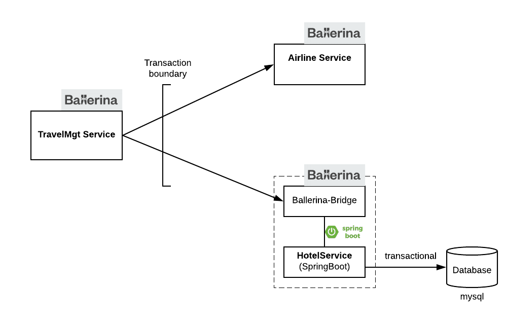

# Microtransactions with Ballerina Sidecar


## Use case


 
 
Successful Scenario 
``` 
curl -X POST -d '{ "full_name": "John Doe", "departure_city": "San Francisco", "destination_city": "Paris", "start_date": "2018-03-20T00:00:00.000Z", "end_date": "2018-03-30T00:00:00.000Z", "airline": "delta", "hotel": "hilton" }'  "http://localhost:6060/travel" -H "Content-Type:application/json"
```

Failure in airline service 
```
curl -X POST -d '{ "full_name": "Richard Roe", "departure_city": "San Francisco", "destination_city": "Paris", "start_date": "2018-03-20T00:00:00.000Z", "end_date": "2018-03-30T00:00:00.000Z", "united": "delta", "hotel": "hilton" }'  "http://localhost:6060/travel" -H "Content-Type:application/json"
```

Failure in hotel service 
```
curl -X POST -d '{ "full_name": "Jane Roe1111111111111", "departure_city": "San Francisco", "destination_city": "Paris", "start_date": "2018-03-20T00:00:00.000Z", "end_date": "2018-03-30T00:00:00.000Z", "airline": "delta", "hotel": "hilton" }'  "http://localhost:6060/travel" -H "Content-Type:application/json"
```
